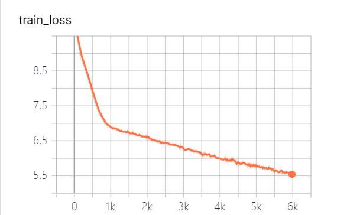

# GPT2-NewsTitle
带有超详细注释的GPT2新闻摘要生成项目

## 项目描述
* 本项目是一个带有超级详细中文注释的基于GPT2模型的新闻摘要生成项目。
* 本项目参考了[GPT2-Chinese](https://github.com/Morizeyao/GPT2-Chinese)、[GPT2-chitchat](https://github.com/yangjianxin1/GPT2-chitchat)、[CDial-GPT](https://github.com/thu-coai/CDial-GPT)、[GPT2](https://github.com/ConnorJL/GPT2)等多个GPT2开源项目，并根据自己的理解，将代码进行重构，添加详细注释，希望可以帮助到有需要的人。
* 本项目使用HuggingFace的[transformers](https://github.com/huggingface/transformers)实现GPT2模型代码编写、训练及测试
* 本项目通过Flask框架搭建了一个Web服务，将新闻摘要生成模型进行工程化，可以通过页面可视化地体验新闻摘要生成效果。
* 本项目的代码详细讲解，可以自行阅读代码，也可查看[代码注释介绍]()。
* 本项目提供的新闻摘要模型是一个6层的小模型（其实是穷人没人卡，只能训练小模型）。

## 文件结构
* config
   * config.json 模型的配置信息，包含n_ctx、n_embd、n_head、n_layer等。
* vocab
   * vocab.txt 字典文件，该字典为大小为13317，删除了将原始字典中的“##中文”，并且增加了“[Content]”、“[Title]”、“[Space]”等标记。
* data_dir 存放数据的文件夹
* templates 存放html页面的文件夹
* data_helper.py 数据预处理文件，将数据进行简单的清洗
* data_set.py 数据类文件，定义模型所需的数据类，方便模型训练使用
* model.py GPT2模型文件，主要对transformers包中GPT2LMHeadModel的重写，修改计算loss部分，只计算预测title部分的loss
* train.py 通过新闻正文生成新闻标题的GPT2模型的训练文件
* generate_title.py 根据训练好的模型，进行新闻标题生成，预测文件
* http_server.py 构建web服务文件

## 运行环境
* gevent == 1.3a1
* flask == 0.12.2
* transformers == 3.0.2
详细见[requirements.txt](./requirements.txt)文件

## 数据集
数据来源于新浪微博，数据链接：https://www.jianshu.com/p/8f52352f0748?tdsourcetag=s_pcqq_aiomsg

| 数据描述     | 下载地址  |
| ------  | -------------  |
| 原始数据     | [百度网盘]()，提取码：      |
| 处理后数据  |  [百度网盘]()，提取码：   |

原始数据为直接从网上下载的新闻数据，处理后数据为使用data_helper.py处理过的数据，可直接用于训练。

## 模型参数
详细见config/config.json文件

| 参数     | 值     |
| ------  | -------------  |
| initializer_range   | 0.02 |
| layer_norm_epsilon  |  1e-05 |
| n_ctx     | 512 |
| n_embd  | 768 |
| n_head  | 12  |
| n_layer  | 6  |
| n_positions | 512 |
| vocab_size  | 13317  |
注意：模型输入除了各个词的向量表示外，还包括文字段落向量表示和位置向量表示。


## 模型文件分享
| 模型   | 下载地址    |
| ------  | -------------  |
| GPT2模型     | [百度网盘]()，提取码：  |

## 模型训练
```
python3 train.py
或
python3 train.py --output_dir output_dir/(自定义保存模型路径) 
```
训练参数可自行添加，包含参数具体如下：

| 参数   | 类型   |  默认值 | 描述  |
| ------  | ------ | ------  | ------ |
| device | str  | "0" | 设置训练或测试时使用的显卡 |
| config_path | str  | "config/config.json" | 模型参数配置信息 |
| vocab_path | str  | "vocab/vocab.txt" | 词表，该词表为小词表，并增加了一些新的标记 |
| train_file_path | str  | "data_dir/train_data.json" | 新闻标题生成的训练数据 |
| test_file_path | str  | "data_dir/test_data.json" | 新闻标题生成的测试数据 |
| data_dir | str  | "./data_dir" | 生成缓存数据的存放路径 |
| num_train_epochs | int  | 5 | 模型训练的轮数 |
| train_batch_size | int  | 16 | 训练时每个batch的大小 |
| test_batch_size | int  | 8 | 测试时每个batch的大小 |
| learning_rate | float  | 1e-4 | 模型训练时的学习率 |
| warmup_proportion | float  | 0.1 | warm up概率，即训练总步长的百分之多少，进行warm up操作 |
| adam_epsilon | float  | 1e-8 | Adam优化器的epsilon值 |
| logging_steps | int  | 20 | 保存训练日志的步数 |
| eval_steps | int  | 4000 | 训练时，多少步进行一次测试 |
| gradient_accumulation_steps | int  | 1 | 梯度积累 |
| max_grad_norm | float  | 1.0 |   |
| output_dir | str  | "output_dir/" | 模型输出路径 |
| seed | int  | 2020 | 随机种子 |
| max_len | int  | 512 | 输入模型的最大长度，要比config中n_ctx小 |
或者修改train.py文件中的set_args函数内容，可修改默认值。

本项目提供的模型，共训练了5个epoch，模型训练损失和测试集损失分别如下：


## 模型测试
```
python3 generate_title.py
或
python3 generate_title.py --top_k 3 --top_p 0.9999 --generate_max_len 32
```
参数可自行添加，包含参数具体如下：

| 参数   | 类型   |  默认值 | 描述  |
| ------  | ------ | ------  | ------ |
| device | str  | "0" | 设置训练或测试时使用的显卡 |
| model_path | str  | "output_dir/checkpoint-55922" | 模型文件路径 |
| vocab_path | str  | "vocab/vocab.txt" | 词表，该词表为小词表，并增加了一些新的标记 |
| batch_size | int  | 5 | 生成标题的个数 |
| generate_max_len | int  | 32 | 生成标题的最大长度 |
| repetition_penalty | float  | 1.2 | 重复处罚率 |
| top_k | int  | 3 | 解码时保留概率最高的多少个标记 |
| top_p | float  | 0.0 | 解码时保留概率累加大于多少的标记 |
| max_len | int  | 512 | 输入模型的最大长度，要比config中n_ctx小 |
测试结果如下：
```
从测试集中抽一篇
content：

title：

从网上随便找一篇新闻
content：

title：

```

## 启动Flask服务
```
python3 http_server.py
或
python3 http_server.py --http_id "0.0.0.0" --port 5555
```
本地测试直接使用"127.0.0.1:5555/news-title-generate"，如果给他人访问，只需将"127.0.0.1"替换成的电脑的IP地址即可。

具体如下图所示：


## 后期工作
* 后期可能会将清华新闻数据、搜狗新闻数据等进行整理清洗，构建一个较完善的新闻摘要数据集。
* 后期可能会训练个

## 参考

## 联系作者
e-mail：logcongcong@gmail.com

知乎：[刘聪NLP](https://www.zhihu.com/people/LiuCongNLP)