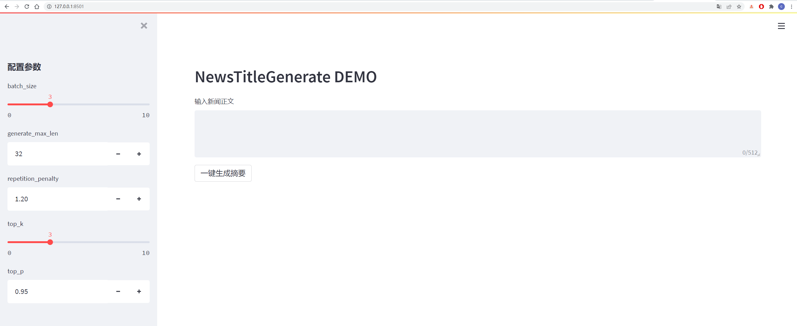
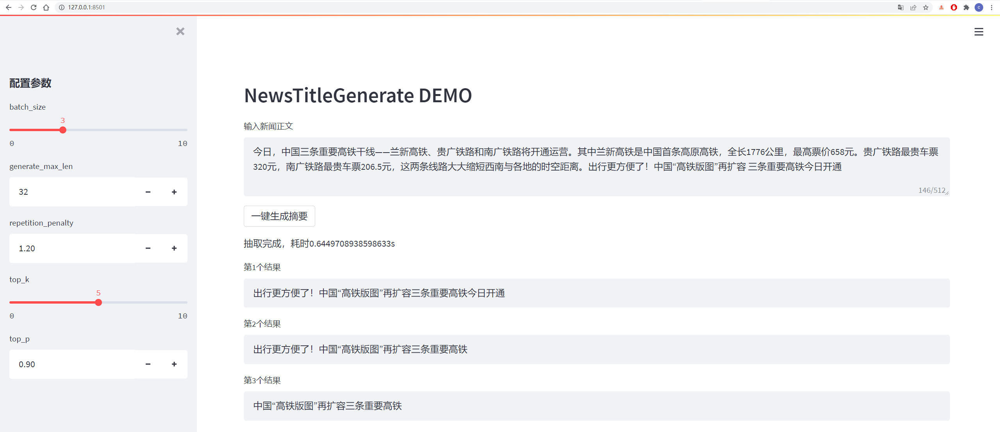
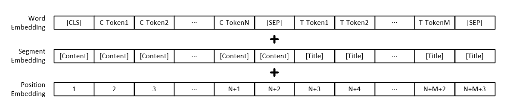
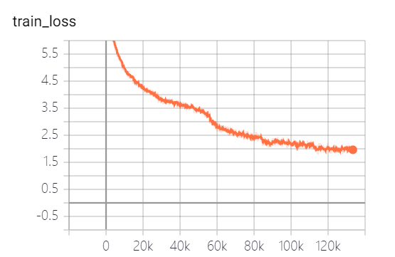
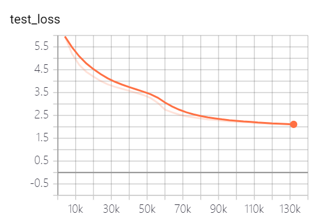

# GPT2-NewsTitle
带有超详细注释的GPT2新闻标题生成项目
## UpDate 02.19.2022
* 增加Streamlit页面，无需使用Flask+HTML就可以部署一个精美页面。
* 详细说明文档，见[算法不会前端，也可以做出好看的界面](https://zhuanlan.zhihu.com/p/469582149)

运行代码
```
streamlit run app.py
or
streamlit run app.py --server.port your_port
```
具体如下图所示：





## UpDate 01.02.2021
* 从网上收集数据，将清华新闻数据、搜狗新闻数据等新闻数据集，以及开源的一些摘要数据进行整理清洗，构建一个较完善的中文摘要数据集。
* 数据集清洗时，仅进行了简单地规则清洗。例如：清洗htlm标记、去除多余空字符、去除图片标记等。
* 处理后数据集详细信息，见[数据集描述](https://zhuanlan.zhihu.com/p/341398288)

| 数据   | 原始数据/项目地址   |  处理后文件下载地址 |
| ------  | ------ | ------  |
| 清华新闻数据 | [地址](http://thuctc.thunlp.org/)  | [百度云盘](https://pan.baidu.com/s/1a-CUtTc5xQFB9_EJaxDklA) 提取码： vhol |
| 搜狗新闻数据 | [地址](https://www.sogou.com/labs/resource/cs.php)  | [百度云盘](https://pan.baidu.com/s/1vgfa5gnIHTYpoYptuHo6gQ) 提取码：ode6 |
| nlpcc2017摘要数据 | [地址](http://tcci.ccf.org.cn/conference/2017/taskdata.php)  | [百度云盘](https://pan.baidu.com/s/1v7QFJ3hl_ALb2DEEq0umRQ) 提取码：e0zq  |
| csl摘要数据 | [地址](https://github.com/P01son6415/CSL)  | [百度云盘](https://pan.baidu.com/s/1qrzhsWq8SGQ1-W8VizSY9w) 提取码：0qot  | 
| 教育培训行业摘要数据 | [地址](https://github.com/wonderfulsuccess/chinese_abstractive_corpus)  | [百度云盘](https://pan.baidu.com/s/1sjOkp8LKGVmY6h0QXl5m7g) 提取码：kjz3  | 
| lcsts摘要数据 | [地址](http://icrc.hitsz.edu.cn/Article/show/139.html)  | [百度云盘](https://pan.baidu.com/s/1J2NcMfxpGGG_BG1Wx0lHGA) 提取码：bzov | 
| 神策杯2018摘要数据 | [地址](https://js.dclab.run/v2/cmptDetail.html?id=242)  | [百度云盘](https://pan.baidu.com/s/1WFimCGk6y-nfSdPRbCrV8Q) 提取码：6f4f | 
| 万方摘要数据 | [地址](https://github.com/EachenKuang/wanfangSpider)  | [百度云盘](https://pan.baidu.com/s/1RFNFagKnxf2JKnjwBDecPA) 提取码： p69g| 
| 微信公众号摘要数据 | [地址](https://github.com/nonamestreet/weixin_public_corpus)  | [百度云盘](https://pan.baidu.com/s/1OBn8kyZEsUeiV_kw4OJYnQ) 提取码： 5has| 
| 微博数据 | [地址](https://www.jianshu.com/p/8f52352f0748?tdsourcetag=s_pcqq_aiomsg)  | [百度云盘](https://pan.baidu.com/s/1-OxrZRm_Q7ejfU-mtngBWg) 提取码： 85t5|
| news2016zh新闻数据 | [地址](https://github.com/brightmart/nlp_chinese_corpus)  | [百度云盘](https://pan.baidu.com/s/1S3YhetbEZuSfYbfSLeRfSg) 提取码： qsj1 |  

数据集集合：[百度云盘](https://pan.baidu.com/s/1ibPTRTgXn8FfVf6DgVFWfA) 提取码： 7am8 

## 项目描述
* 本项目是一个带有超级详细中文注释的基于GPT2模型的新闻标题生成项目。
* 本项目参考了[GPT2-Chinese](https://github.com/Morizeyao/GPT2-Chinese)、[GPT2-chitchat](https://github.com/yangjianxin1/GPT2-chitchat)、[CDial-GPT](https://github.com/thu-coai/CDial-GPT)、[GPT2](https://github.com/ConnorJL/GPT2)等多个GPT2开源项目，并根据自己的理解，将代码进行重构，添加详细注释，希望可以帮助到有需要的人。
* 本项目使用HuggingFace的[transformers](https://github.com/huggingface/transformers)实现GPT2模型代码编写、训练及测试。
* 本项目通过Flask框架搭建了一个Web服务，将新闻摘要生成模型进行工程化，可以通过页面可视化地体验新闻标题生成效果。
* 本项目的代码详细讲解，可以自行阅读代码，也可查看[代码注释介绍](https://zhuanlan.zhihu.com/p/338171330)。
* 本项目提供的新闻标题模型是一个6层的小模型（其实是穷人没人卡，只能训练小模型），并且在训练该模型过程中，没有加载预训练的GPT2模型而是随机初始化的参数，并且训练轮数较少（5轮，还没收敛完），因此效果一般。如果想要更好效果的模型，可以按照个人需求训练一个模型。
* 本项目的目的是带领大家走一遍GPT2生成模型的训练、测试及部署全部流程。

## 文件结构
* config
   * config.json 模型的配置信息，包含n_ctx、n_embd、n_head、n_layer等。
* vocab
   * vocab.txt 字典文件，该字典为大小为13317，删除了将原始字典中的“##中文”，并且增加了“[Content]”、“[Title]”、“[Space]”等标记。
* data_dir 存放数据的文件夹
* templates 存放html页面的文件夹
* data_helper.py 数据预处理文件，将数据进行简单的清洗
* data_set.py 数据类文件，定义模型所需的数据类，方便模型训练使用
* model.py GPT2模型文件，主要对transformers包中GPT2LMHeadModel的重写，修改计算loss部分，只计算预测title部分的loss
* train.py 通过新闻正文生成新闻标题的GPT2模型的训练文件
* generate_title.py 根据训练好的模型，进行新闻标题生成，预测文件
* http_server.py 构建web服务文件

## 运行环境
* gevent == 1.3a1
* flask == 0.12.2
* transformers == 3.0.2

详细见[requirements.txt](./requirements.txt)文件

## 数据集
数据来源于新浪微博，数据链接：https://www.jianshu.com/p/8f52352f0748?tdsourcetag=s_pcqq_aiomsg

| 数据描述     | 下载地址  |
| ------  | -------------  |
| 原始数据    | [百度网盘](https://pan.baidu.com/s/1QX7Vvlky_gxGI2F3cQ2nOQ)，提取码： nqzi |
| 处理后数据  |  [百度网盘](https://pan.baidu.com/s/180aTaZe-5jopVBBJhBrTWg)，提取码： duba |

原始数据为直接从网上下载的新闻数据，处理后数据为使用data_helper.py处理过的数据，可直接用于训练。

## 模型参数
详细见config/config.json文件

| 参数     | 值     |
| ------  | -------------  |
| initializer_range   | 0.02 |
| layer_norm_epsilon  |  1e-05 |
| n_ctx     | 512 |
| n_embd  | 768 |
| n_head  | 12  |
| n_layer  | 6  |
| n_positions | 512 |
| vocab_size  | 13317  |

注意：模型输入除了各个词的向量表示外，还包括文字段落向量表示和位置向量表示。


## 模型文件分享
| 模型   | 下载地址    |
| ------  | -------------  |
| GPT2模型     | [百度网盘](https://pan.baidu.com/s/1X4yu1lh3uLIf18rP_6K6nw)，提取码： 165b |

## 模型训练
```
python3 train.py
或
python3 train.py --output_dir output_dir/(自定义保存模型路径) 
```
训练参数可自行添加，包含参数具体如下：

| 参数   | 类型   |  默认值 | 描述  |
| ------  | ------ | ------  | ------ |
| device | str  | "0" | 设置训练或测试时使用的显卡 |
| config_path | str  | "config/config.json" | 模型参数配置信息 |
| vocab_path | str  | "vocab/vocab.txt" | 词表，该词表为小词表，并增加了一些新的标记 |
| train_file_path | str  | "data_dir/train_data.json" | 新闻标题生成的训练数据 |
| test_file_path | str  | "data_dir/test_data.json" | 新闻标题生成的测试数据 |
| pretrained_model_path | str  | None | 预训练的GPT2模型的路径 |
| data_dir | str  | "data_dir" | 生成缓存数据的存放路径 |
| num_train_epochs | int  | 5 | 模型训练的轮数 |
| train_batch_size | int  | 16 | 训练时每个batch的大小 |
| test_batch_size | int  | 8 | 测试时每个batch的大小 |
| learning_rate | float  | 1e-4 | 模型训练时的学习率 |
| warmup_proportion | float  | 0.1 | warm up概率，即训练总步长的百分之多少，进行warm up操作 |
| adam_epsilon | float  | 1e-8 | Adam优化器的epsilon值 |
| logging_steps | int  | 20 | 保存训练日志的步数 |
| eval_steps | int  | 4000 | 训练时，多少步进行一次测试 |
| gradient_accumulation_steps | int  | 1 | 梯度积累 |
| max_grad_norm | float  | 1.0 |   |
| output_dir | str  | "output_dir/" | 模型输出路径 |
| seed | int  | 2020 | 随机种子 |
| max_len | int  | 512 | 输入模型的最大长度，要比config中n_ctx小 |

或者修改train.py文件中的set_args函数内容，可修改默认值。

本项目提供的模型，共训练了5个epoch，模型训练损失和测试集损失分别如下：




模型其实还没有训练完全，按照loss走势，还可以继续训练。
## 模型测试
```
python3 generate_title.py
或
python3 generate_title.py --top_k 3 --top_p 0.9999 --generate_max_len 32
```
参数可自行添加，包含参数具体如下：

| 参数   | 类型   |  默认值 | 描述  |
| ------  | ------ | ------  | ------ |
| device | str  | "0" | 设置训练或测试时使用的显卡 |
| model_path | str  | "output_dir/checkpoint-139805" | 模型文件路径 |
| vocab_path | str  | "vocab/vocab.txt" | 词表，该词表为小词表，并增加了一些新的标记 |
| batch_size | int  | 3 | 生成标题的个数 |
| generate_max_len | int  | 32 | 生成标题的最大长度 |
| repetition_penalty | float  | 1.2 | 重复处罚率 |
| top_k | int  | 5 | 解码时保留概率最高的多少个标记 |
| top_p | float  | 0.95 | 解码时保留概率累加大于多少的标记 |
| max_len | int  | 512 | 输入模型的最大长度，要比config中n_ctx小 |

测试结果如下：
```
从测试集中抽一篇
content：
今日，中国三条重要高铁干线——兰新高铁、贵广铁路和南广铁路将开通运营。其中兰新高铁是中国首条高原高铁，全长1776公里，最高票价658元。贵广铁路最贵车票320元，南广铁路最贵车票206.5元，这两条线路大大缩短西南与各地的时空距离。出行更方便了！中国“高铁版图”再扩容 三条重要高铁今日开通
title：
生成的第1个标题为：中国“高铁版图”再扩容 三条重要高铁今日开通
生成的第2个标题为：贵广铁路最高铁版图
生成的第3个标题为：出行更方便了！中国“高铁版图”再扩容三条重要高铁今日开通

从网上随便找一篇新闻
content：
值岁末，一年一度的中央经济工作会议牵动全球目光。今年的会议，背景特殊、节点关键、意义重大。12月16日至18日。北京，京西宾馆。站在“两个一百年”奋斗目标的历史交汇点上，2020年中央经济工作会议谋划着中国经济发展大计。习近平总书记在会上发表了重要讲话，深刻分析国内外经济形势，提出2021年经济工作总体要求和政策取向，部署重点任务，为开局“十四五”、开启全面建设社会主义现代化国家新征程定向领航。
title：
生成的第1个标题为：习近平总书记在京会上发表重大计划 提出2025年经济工作总体要求和政策
生成的第2个标题为：习近平总书记在会上发表重要讲话
生成的第3个标题为：习近平总书记在会上发表重要讲话，深刻分析国内外经济形势
```
解码采用top_k和top_p解码策略，有一定的随机性，可重复生成。
## 启动Flask服务
```
python3 http_server.py
或
python3 http_server.py --http_id "0.0.0.0" --port 5555
```
本地测试直接使用"127.0.0.1:5555/news-title-generate"，如果给他人访问，只需将"127.0.0.1"替换成的电脑的IP地址即可。

具体如下图所示：


## 未来工作
- [x] 后期可能会将清华新闻数据、搜狗新闻数据等新闻数据集进行整理清洗，构建一个较完善的新闻标题数据集。
- [ ] 后期可能会使用新闻数据训练一个小的GPT2预训练模型。
- [ ] 后期可能会对已上传的新闻标题模型进行更新，训练一个效果较好的模型。

## 致谢
* 感谢[@JunkRoy](https://github.com/JunkRoy)提供的Web界面


## 参考
* [GPT2-Chinese](https://github.com/Morizeyao/GPT2-Chinese)
* [GPT2-chitchat](https://github.com/yangjianxin1/GPT2-chitchat)
* [CDial-GPT](https://github.com/thu-coai/CDial-GPT)
* [GPT2](https://github.com/ConnorJL/GPT2)
* [transformers](https://github.com/huggingface/transformers)

## Citing
```
@misc{GPT2-NewsTitle,
  author = {Cong Liu},
  title = {Chinese NewsTitle Generation Project by GPT2},
  year = {2020},
  publisher = {GitHub},
  journal = {GitHub repository},
  url="https://github.com/liucongg/GPT2-NewsTitle",
}
```

## 联系作者
e-mail：logcongcong@gmail.com

知乎：[刘聪NLP](https://www.zhihu.com/people/LiuCongNLP)

公众号：[NLP工作站]()

